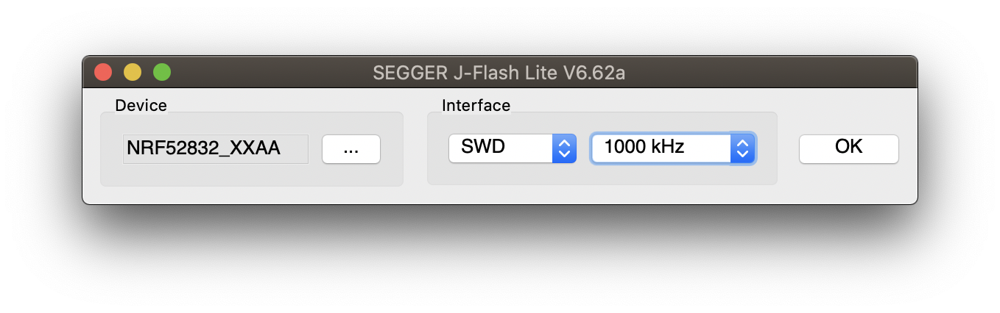
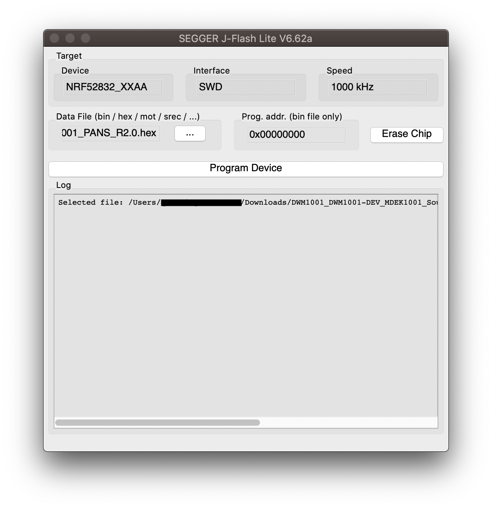
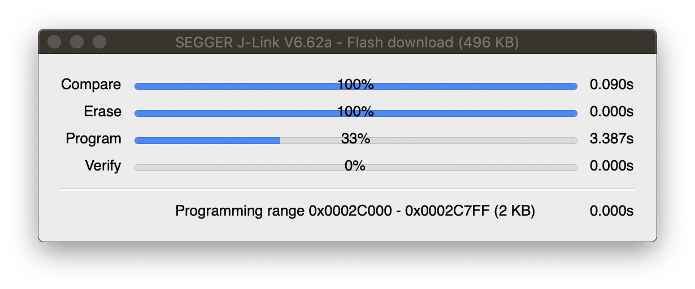

# DWM1001-DEV


# Installation

## Flasher la DWM1001-DEV

Pour fonctionner, la carte DWM1001-DEV a besoin d'être flashée. 

* Télécharger le dossier dans lequel se trouve l'image à flasher, ainsi que toutes les documentations sur le [site de Decawave](https://www.decawave.com/1001-license/) (fichier de plus de 1.9 Go).

* Installer "J-FlashLite" disponible sur le site de [SEGGER](https://www.segger.com/downloads/jlink#J-LinkSoftwareAndDocumentationPack), section "J-Link Software and Documentation Pack".

* Ouvrir J-FlashLite.

* Sélectionner en device nRF52832_xxAA (Manufacturer : Nordic Semi).

* Interface SWD, fréquence 1000 kHz, "OK".



* Selectionner le data file ```DWM1001_DWM1001-DEV_MDEK1001_Sources_and_Docs_v9/DWM1001/Factory_Firmware_Image/DWM1001_PANS_R2.0.hex```.



* Brancher la DWM1001-DEV.


* Cliquer sur "Program Ship".



La carte est flashée, les LEDs ont du changer de couleur.


## Configurer la DWM1001-DEV

La carte peut être configurer de 3 manières différentes : 
- en *anchor* : une balise fixe, dont on va configurer la position.
- en *initiator* : un anchor qui va "initier" le réseau, il en faut au minimum 1.
- en *tag* : une balise mobile, celle qu'on veut localiser

On peut la configurer en utilisant sont interface SPI. Par soucis de simplicité on utilisera PuTTy, disponible en téléchargement sur le [site de PuTTy](https://putty.org) pour Windows, ou en ligne de commande # A FINIR

La connexion se fait à l'aide d'un terminal SPI. (```dev/tty_____```). 
